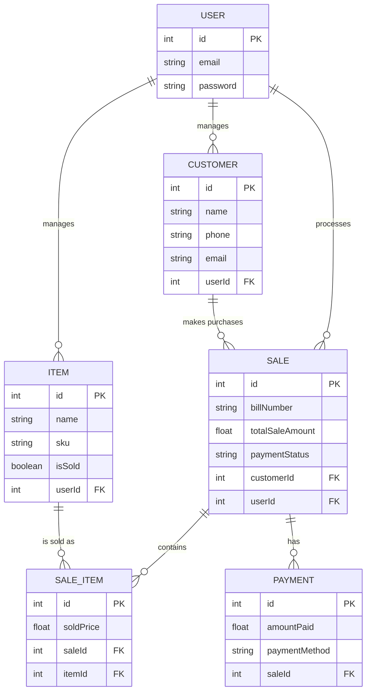

# 💎 GemTrack

**Hosted Frontend:** https://gem-track-five.vercel.app/login

### A Comprehensive Web POS & Inventory System for Jewelers

---

## 🔗 Live Demo

**Frontend (hosted):** https://gem-track-five.vercel.app/login

---

## 📖 Overview

**GemTrack** empowers jewelers to manage their entire business from a modern, responsive web dashboard.

It bridges the gap between powerful desktop POS systems and overly simplistic mobile apps—handling complex jewelry data such as **HUID, Wastage, Making Charges, Stone Charges**, and more.

---

## 🚀 Key Features

### 🛡️ Authentication & Security
- Secure user login & registration  
- JWT-protected routes  

### 💍 Inventory Management
- Track HUID, SKU, Purity, Gross/Net Weight  
- Making Charges, Wastage %, GST %, Stone Charges  
- Barcode generation & printing  
- Rich item cards with metadata  

### 👥 Customer & Sales
- Customer profiles (Name, Phone, Email, Address, PAN)  
- Web POS checkout  
- Auto-update inventory on sale  
- Sales logs with Paid / Partial / Unpaid status  

### 📊 Business Intelligence
- Dashboard with analytics & charts  
- Live gold/silver rates (GoldAPI)  

### ⚡ Performance
- Designed for 10,000+ items  
- Server-side pagination, search & filter  
- Optimized partial data fetching  

---

## 🛠️ Tech Stack

| Layer | Technology |
|---|---|
| **Frontend** | Next.js (App Router), React, TailwindCSS, Shadcn UI |
| **Backend** | Node.js, Express.js (Serverless Functions) |
| **Database** | PostgreSQL (Neon) + Prisma ORM |
| **Auth** | JWT, bcrypt.js |
| **Hosting** | Vercel |
| **External APIs** | GoldAPI.io |

---

## 🏗️ System Design & Architecture

### Object-Oriented Programming (OOP)
GemTrack's backend has been strictly refactored to adhere to the 4 pillars of OOP:
- **Abstraction**: `BaseRepository` and `BaseService` define absolute contracts containing required generic methods (like `findAll` and `execute`) that hide complex Prisma operations from the controllers.
- **Encapsulation**: Service classes utilize private fields (e.g., `#prisma`, `#itemRepo`) and private internal computations (e.g., `#calculatePaymentStatus`) to protect states from unauthorized external interference. 
- **Inheritance**: `ItemRepository` and `CustomerRepository` heavily inherit from `BaseRepository`, immediately securing complex data operations identically across all subclass domain entities without code duplication.
- **Polymorphism**: `ItemRepository.delete()` distinctly overrides the standard parent deletion protocol to inject targeted business logic (blocking deletion if the item `isSold`).

### Design Patterns Applied
1. **Repository Pattern**: Heavily utilized to abstract and decouple the Express.js networking controllers entirely away from the underlying database data-access layer.
2. **Singleton Pattern**: The `PrismaClient` instantiation is securely pooled strictly through a singleton export (`prismaClient.js`). This definitively prevents connection pool exhaustion crashes historically observed in concurrent deployments.
3. **Dependency Injection (DI)**: The `SaleService` module explicitly maps and accepts injected `ItemRepository` and `CustomerRepository` inputs through its constructor, fully isolating cross-domain knowledge logic for robust scalable boundaries.

### Software Development Life Cycle (SDLC)
GemTrack leverages an **Iterative & Incremental SDLC**, initially starting as a procedural Minimal Viable Product (MVP) to establish the necessary business data rules, before incrementally pivoting into a highly-scalable OOP architecture engineered for complex production routing dynamically testing all constraints iteratively.

### Entity-Relationship (ER) Diagram

