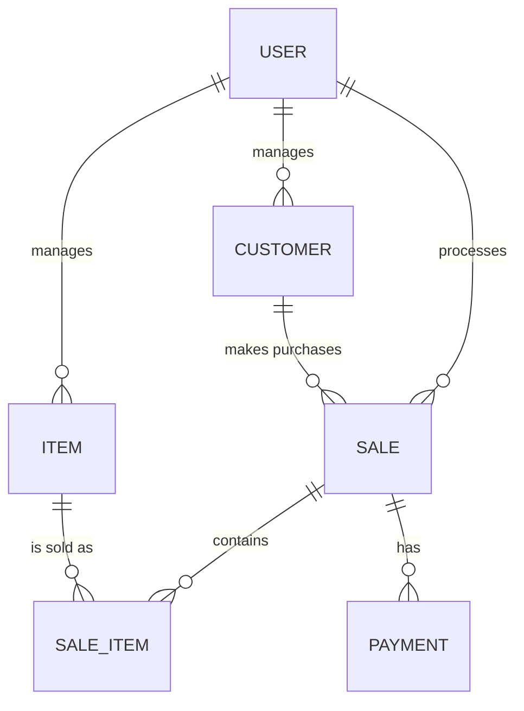

# 📊 /diagrams — System & Architecture Diagrams

This folder contains all visual diagrams for the GemTrack system, used to communicate architecture, data flow, and object relationships for the university submission.

---

## Intended Contents

| File | Description |
|---|---|
| `er_diagram.png` / `er_diagram.md` | Entity-Relationship (ER) diagram for the PostgreSQL database |
| `class_diagram.png` | UML Class Diagram showing OOP hierarchy (BaseRepository → ItemRepository / CustomerRepository) |
| `architecture_diagram.png` | High-level system architecture: Next.js frontend → Express.js API → PostgreSQL |
| `sequence_diagram.png` | Sequence diagram for the POS checkout / sale processing flow |

---

## System Architecture Overview

```
┌────────────────────────────────────────┐
│           Next.js Frontend             │
│  (React, TailwindCSS, Shadcn UI)       │
│  Hosted on: Vercel                     │
└────────────────┬───────────────────────┘
                 │ HTTPS (REST API calls)
┌────────────────▼───────────────────────┐
│        Express.js Backend              │
│  ┌──────────┐  ┌──────────┐           │
│  │Controllers│→│ Services │           │
│  └──────────┘  └────┬─────┘           │
│                     │                 │
│              ┌──────▼──────┐          │
│              │ Repositories│          │
│              └──────┬──────┘          │
│                     │ Prisma ORM      │
└─────────────────────┼─────────────────┘
                       │
┌──────────────────────▼──────────────────┐
│          PostgreSQL (Neon Cloud)         │
│  Tables: users, items, customers,       │
│          sales, sale_items, payments,   │
│          shop_profile                   │
└──────────────────────────────────────────┘
```

---

## OOP Class Hierarchy (for Class Diagram)

```
BaseRepository (abstract)
├── ItemRepository       ← overrides findAll(), delete()
└── CustomerRepository   ← overrides findAll()

BaseService (abstract)
└── SaleService          ← implements validate(), execute()
```

---

## ER Diagram (Inline)


